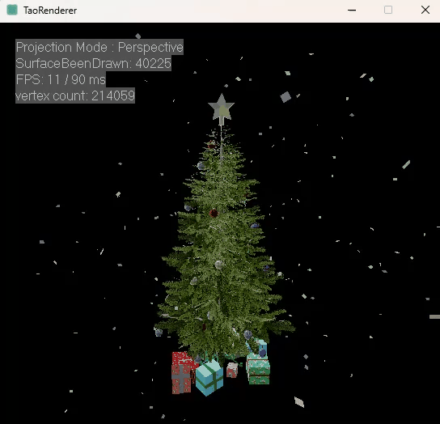

# TaoRenderer
TaoRenderer is a software rasterization renderer based on c++ 20. The main purpose of the project is to learn the principles of modern rendering. Currently only Windows is supported (uses win32 to display window and image)


## Previews

### Wireframe && Clip


### Blinn-Phong 


### PBR + IBL


### Furina with only BaseColor


### SantaTree



## Feature
### simple math library
* vector library
* matrix library
* utility functions

### Programmable shader (writing in c++)
* vertex shader
* pixel shader

### culling & clipping
* back-face culling: use the normal of the triangle plane
* homogeneous clipping: clip is performed only for the near clipping plane

### z-buffer
* depth testing
* reverse z-buffer

### Edge Equation
* traversal triangle using a bounding rectangle
* the Edge Equation is used to perform the inside test of the triangle

### Perspective correct interpolation
* use Top-Left rule to handle boundary pixels

### texture sampling
* use bilinear interpolation to get better texture effect
* cubemap sampling

### orbital camera controls
* Orbit
* Pan
* Zoom
* Reset

### tangent space normal mapping
### ACES tone mapping
### shading model
* Blinn-Phong shading
* Physically Based Shading (use Cook-torrance BRDF)

### material inspector
* use keyboard number to switch material inspector
* Blinn-Phong material inspector
* Physically Based Shading material inspector

### wireframe rendering
### image-based lighting (IBL)
* irradiance map
* prefilter specular environment map
* use cmgen to automatic generate the IBL resource

### skybox
* place a plane on the far clipping plane
* switch the skybox at runtime

### other control
* switch the shading model at runtime
* switch the model at runtime


## Build
A CMakeLists.txt file is provided for generating project files using CMake

### Visual Studio
```bash
mkdir build
cd build
cmake -G "Visual Studio 17 2022" ..
start Renderer.sln
```

## Control
### Camera Control
* Orbit: left mouse button
* Pan: right mouse button
* Zoom: mouse wheel \ Q E
* move model: W A S D
* Reset Camera: Space

### Material Inspector Control
* Blinn-Phong shading: keyboard number 1-7
* Physically Based Shading: keyboard number 1-8
* Wireframe rendering: keyboard number 0

### Assets Control
* Switch model: keyboard up/down
* Switch skybox: keyboard left/right

### skybox
* place a plane on the far clipping plane
* switch the skybox at runtime

### other control
* switch the shading model at runtime
* switch the model at runtime

